<div align="center">

# 🚩 Loker Sus

**Cek lowongan kerja ini sus atau nggak, pakai AI.**

**[🌐 Coba Live Demo](https://lokersus-frontend.vercel.app/index.html)**


[](https://lokersus-frontend.vercel.app/index.html)


</div>

<!-- TODO: tambahkan screenshot tampilan web, misal docs/images/screenshot-home.png -->

## Daftar Isi
- [Live Demo](#live-demo)
- [Tentang Proyek](#tentang-proyek)
- [Fitur](#fitur)
- [Cara Kerja](#cara-kerja)
- [Dataset](#dataset)
- [Metodologi](#metodologi)
- [Hasil dan Evaluasi](#hasil-dan-evaluasi)
- [Interpretasi Model](#interpretasi-model)
- [Keterbatasan](#keterbatasan)
- [Struktur Proyek](#struktur-proyek)
- [Instalasi dan Menjalankan](#instalasi-dan-menjalankan)
- [Dokumentasi API](#dokumentasi-api)
- [Konfigurasi](#konfigurasi)
- [Deploy](#deploy)
- [Rencana Pengembangan](#rencana-pengembangan)
- [Disclaimer](#disclaimer)
- [Kredit](#kredit)

## Live Demo
**[lokersus-frontend.vercel.app](https://lokersus-frontend.vercel.app/index.html)**

Cara mencoba:
1. Buka link di atas.
2. Tempel teks lowongan kerja **berbahasa Inggris** (atau klik "Pakai contoh").
3. Klik "Cek lowongan", lalu lihat peluang palsu dan verdict-nya.

> Backend memakai paket gratis Render yang "tidur" kalau 15 menit tidak ada pengunjung. Klik pertama bisa butuh sekitar 1 menit, setelah itu normal.

## Tentang Proyek
**Loker Sus** adalah aplikasi web yang membantu pencari kerja mengecek apakah sebuah lowongan kerja mencurigakan. Pengguna menempelkan teks lowongan, lalu model machine learning memberi **peluang lowongan itu palsu** beserta verdict yang mudah dibaca (*Kayaknya legit*, *Hati-hati*, atau *Sus banget*).

Proyek ini terdiri dari tiga bagian:
1. **Model AI**: pipeline NLP + ensemble model yang dilatih di notebook (`notebooks/FakeJobDetector_Full.ipynb`).
2. **Backend**: API FastAPI yang memuat model dan melayani prediksi.
3. **Frontend**: web statis (HTML, CSS, JavaScript) untuk pengguna.

> ⚠️ **Model hanya paham teks bahasa Inggris** karena dilatih dengan dataset berbahasa Inggris. Lihat [Keterbatasan](#keterbatasan).

## Fitur
- Cek lowongan dari teks bebas, hasil berupa peluang palsu (0 sampai 100%) dan verdict.
- Meter skor dengan zona warna sesuai threshold model.
- Input opsional "Info tambahan" (ada logo, profil perusahaan, benefit, dst.) yang juga dipakai model.
- Peringatan otomatis kalau teks kelihatannya bahasa Indonesia.
- Mode demo (tanpa backend) untuk melihat tampilan.
- Halaman "Cara kerja" yang menjelaskan model dan cara membaca hasil.
- API REST dengan dokumentasi otomatis (`/docs`).

## Cara Kerja
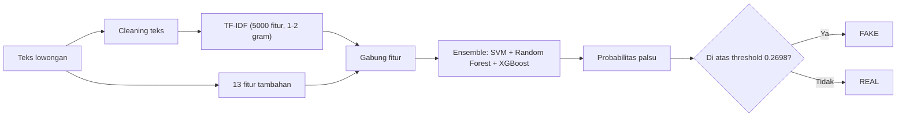

**Cleaning teks:** huruf kecil, buang karakter non-ASCII, URL, tag HTML, angka, tanda baca, lalu buang stopword (stopword Inggris + beberapa kata umum lowongan seperti *experience*, *team*, *company*).

**Fitur tambahan (13):**
- 6 fitur numerik: jumlah huruf kapital, tanda seru, tanda tanya, jumlah kata (setelah cleaning), rata-rata panjang kata, jumlah kata mentah.
- 7 fitur biner: `has_company_profile`, `has_requirements`, `has_benefits`, `has_salary_range`, `has_company_logo`, `telecommuting`, `has_questions`.

## Dataset
Dataset publik lowongan kerja berbahasa Inggris (`fake_job_postings.csv`, dikenal sebagai EMSCAD, tersedia di Kaggle).

| | Jumlah | Persen |
|---|---|---|
| Lowongan asli (Real) | 17.014 | 95,2% |
| Lowongan palsu (Fake) | 866 | 4,8% |
| **Total** | **17.880** | |

Datanya **sangat tidak seimbang**: lowongan palsu hanya sekitar 1 dari 20.

| Distribusi kelas | Data kosong per kolom |
|---|---|
| 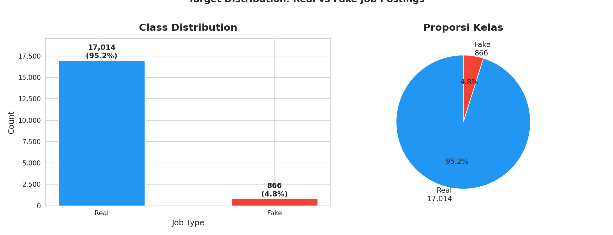 | 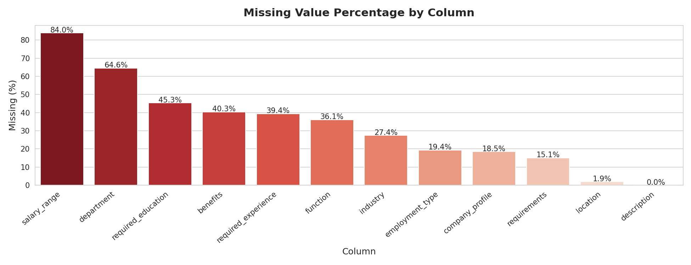 |

Kolom dengan data kosong terbanyak: `salary_range` (84,0%), `department` (64,6%), `required_education` (45,3%), `benefits` (40,3%), `required_experience` (39,4%).

Beberapa temuan dari eksplorasi data:
- Lowongan palsu cenderung **lebih pendek** (jumlah kata dan karakter lebih sedikit).
- Lowongan asli punya lebih banyak outlier tanda seru dan tanda tanya.

| Panjang teks | Fitur numerik |
|---|---|
| 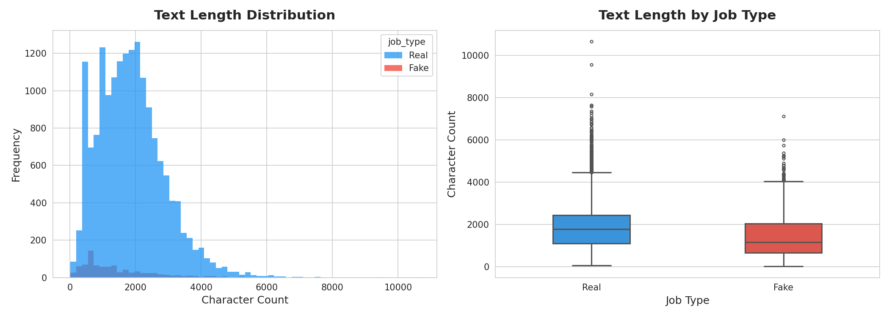 | 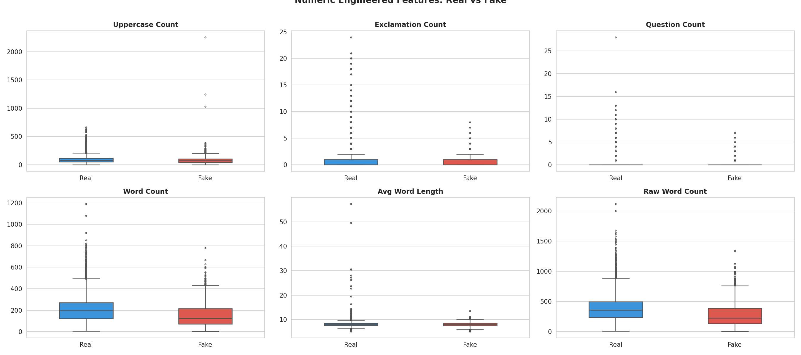 |

| Word cloud lowongan asli | Word cloud lowongan palsu |
|---|---|
|  | 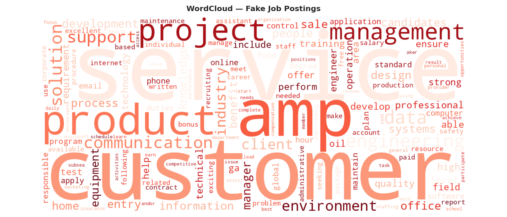 |

## Metodologi
1. **Pembersihan data**: hapus duplikat, gabungkan kolom teks (judul, profil perusahaan, deskripsi, persyaratan, benefit) jadi satu teks.
2. **Feature engineering**: 6 fitur numerik + 7 fitur biner (lihat di atas).
3. **Vektorisasi teks**: TF-IDF, 5.000 fitur, unigram dan bigram.
4. **Pembagian data**: 80% latih (14.304) dan 20% uji (3.576).
5. **Penanganan data tidak seimbang**: SMOTE **hanya pada data latih**, jadi data uji tetap asli.

| Sebelum SMOTE | Sesudah SMOTE |
|---|---|
| Real 13.611, Fake 693 | Real 13.611, Fake 13.611 |

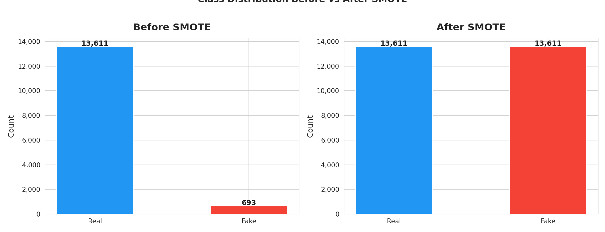

6. **Membandingkan 5 model**: Logistic Regression, Linear SVM, Random Forest, XGBoost, Multinomial Naive Bayes.
7. **Tuning dan cek overfitting**: parameter `C` pada SVM, dan model dibuat lebih teregulasi untuk menekan jarak skor latih dan uji.
8. **Ensemble**: gabungan Linear SVM (dikalibrasi), Random Forest, dan XGBoost dengan *soft voting*.
9. **Optimasi threshold**: dicari threshold yang mengutamakan recall (F2).

| Tuning `C` pada SVM | Cek overfitting |
|---|---|
| 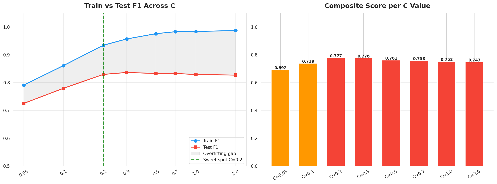 | 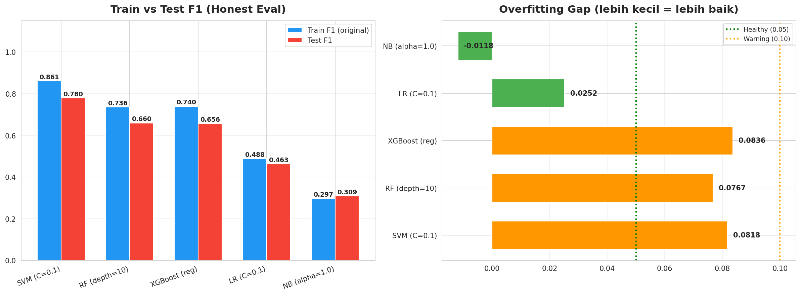 |

Untuk SVM, nilai `C = 0,2` dipilih sebagai titik tengah antara skor uji dan jarak overfitting.

## Hasil dan Evaluasi
Semua evaluasi memakai **data uji 3.576 lowongan** (3.403 asli, 173 palsu).

### Perbandingan model tunggal
Metrik dihitung dari jumlah pada confusion matrix.

| Model | AUC | Precision | Recall | F1 | Akurasi | FP | FN |
|---|---|---|---|---|---|---|---|
| Logistic Regression | 0.980 | 0.431 | 0.902 | 0.583 | 0.938 | 206 | 17 |
| Linear SVM | 0.992 | 0.916 | 0.757 | 0.829 | 0.985 | 12 | 42 |
| Random Forest | 0.992 | 0.992 | 0.682 | 0.808 | 0.984 | 1 | 55 |
| XGBoost | 0.990 | 0.941 | 0.740 | 0.828 | 0.985 | 8 | 45 |
| Multinomial NB | 0.910 | 0.222 | 0.827 | 0.350 | 0.852 | 501 | 30 |

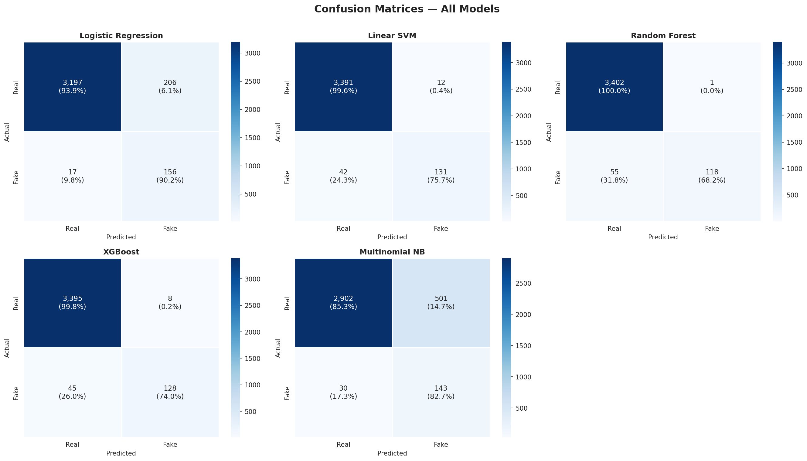

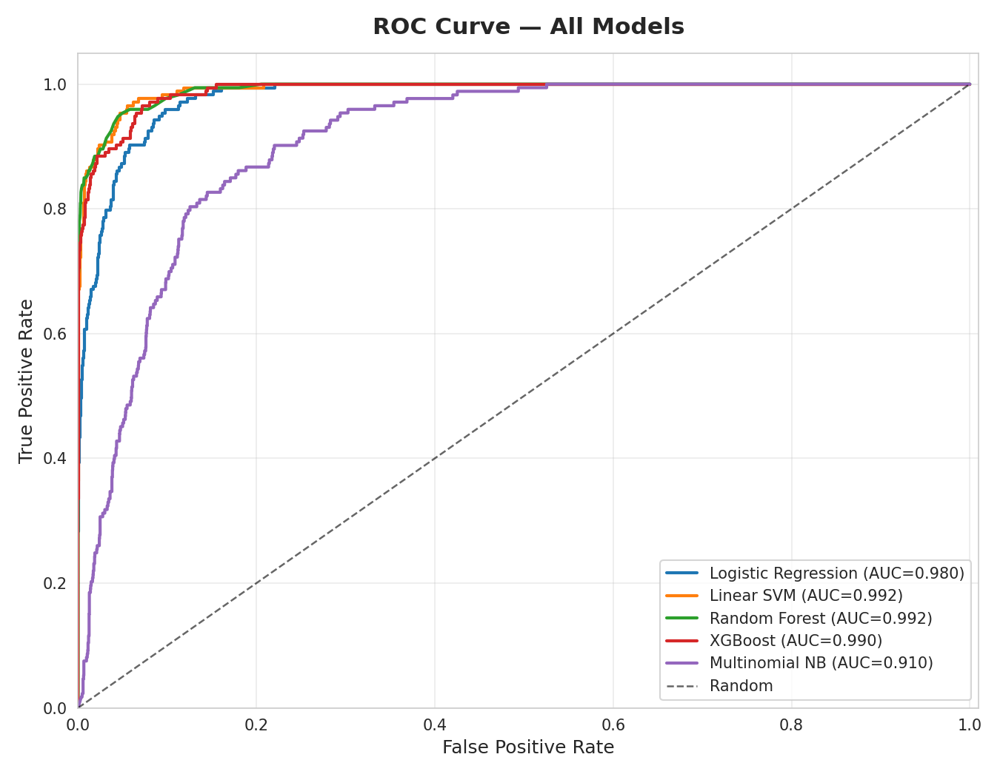

**Cara bacanya:** Random Forest hampir tidak pernah salah menuduh (FP = 1) tapi melewatkan banyak lowongan palsu (FN = 55). Logistic Regression dan Naive Bayes menangkap banyak lowongan palsu tapi terlalu sering salah menuduh lowongan asli. Linear SVM dan XGBoost paling seimbang.

### Model akhir (ensemble) pada threshold 0,270
Angka di bawah dihitung dari jumlah kesalahan pada grafik error analysis (43 FP dan 25 FN dari 3.576 data uji).

| Metrik | Nilai |
|---|---|
| Precision | 0.775 |
| Recall | 0.855 |
| F1 | 0.813 |
| F2 | 0.838 |
| Akurasi | 0.981 (3.508 dari 3.576 benar) |
| False Positive | 43 (lowongan asli salah ditandai palsu) |
| False Negative | 25 (lowongan palsu lolos) |

Skor *Average Precision* kurva PR adalah **0,9030**. Pada threshold bawaan 0,50, F1 ensemble adalah 0,829. Threshold **0,270** dipilih lewat optimasi F2, jadi recall naik (lowongan palsu lebih banyak tertangkap) dengan harga precision turun.

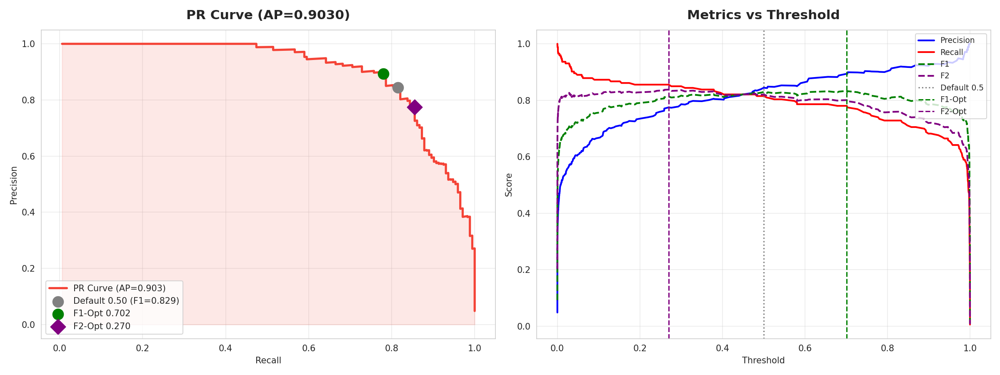

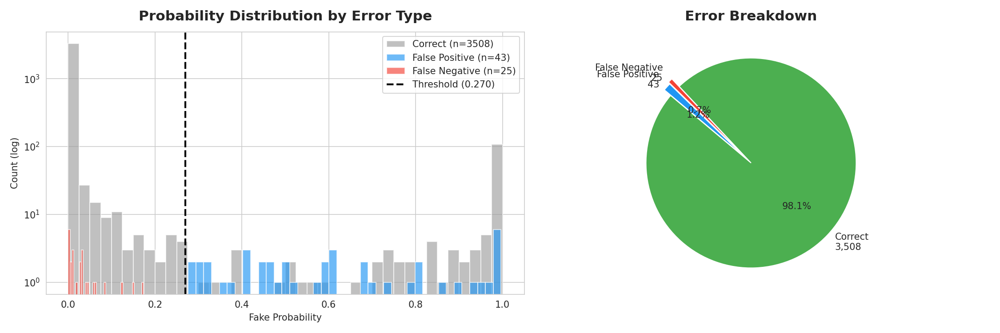

## Interpretasi Model
**Kata paling berpengaruh** (dari koefisien model linear):

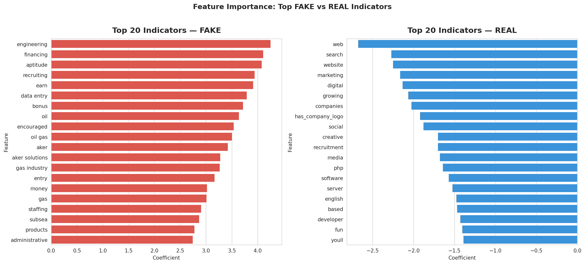

**Analisis SHAP** menunjukkan fitur yang paling menggerakkan prediksi: `raw_word_count`, `has_company_logo`, `question_count`, `has_company_profile`, `has_benefits`, dan `uppercase_count`.

| SHAP global | SHAP per contoh |
|---|---|
| 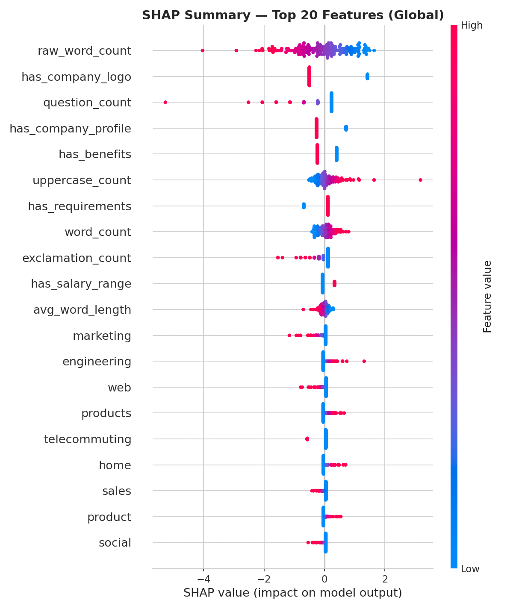 | 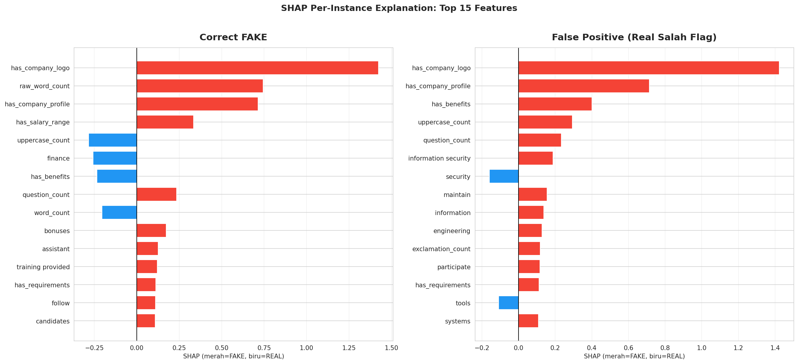 |

Dua hal penting dari SHAP:
- Lowongan **tanpa logo, tanpa profil perusahaan, atau tanpa benefit** didorong kuat ke arah "palsu". Pada contoh *false positive*, tiga fitur kelengkapan ini menjadi penyebab utama lowongan asli salah ditandai palsu.
- Teks yang **pendek** cenderung menaikkan skor palsu.

## Keterbatasan
Bagian ini penting dibaca sebelum memakai hasil model.

1. **Hanya bahasa Inggris.** Pipeline memakai stopword Inggris dan membuang karakter non-ASCII. Lowongan berbahasa Indonesia tidak bisa dinilai dengan benar.
2. **Model bisa belajar pola dataset, bukan pola penipuan umum.** Beberapa kata penanda "palsu" seperti *oil gas*, *aker solutions*, dan *subsea* kemungkinan berasal dari sekelompok lowongan serupa di dataset. Beberapa arah pengaruh fitur juga berlawanan dengan intuisi, misalnya adanya persyaratan atau rentang gaji sedikit menaikkan skor palsu.
3. **Sangat bergantung pada kelengkapan lowongan.** Karena fitur biner dan panjang teks berpengaruh besar, lowongan asli yang singkat atau tidak punya logo mudah kena curiga. Itu sebabnya frontend menyediakan "Info tambahan". Kalau tidak diisi, backend memakai nilai 0 (kosong) untuk semua fitur biner, sama seperti fungsi `predict_job_posting` di notebook.
4. **Data palsu hanya 866 contoh** dan berasal dari satu dataset, jadi pola penipuan baru bisa lolos.
5. **Threshold mengutamakan recall.** Hasilnya 43 lowongan asli salah ditandai palsu dan 25 lowongan palsu lolos dari 3.576 data uji.
6. **Bukan pengganti kewaspadaan.** Hasil model adalah peringatan awal, bukan keputusan akhir.

## Struktur Proyek
```
loker-sus-fullstack/
├── backend/
│   ├── main.py                  # API FastAPI + preprocessing
│   ├── requirements.txt
│   └── models/                  # taruh 3 file .pkl di sini
├── frontend/
│   ├── index.html               # halaman cek loker
│   ├── cara-kerja.html          # halaman penjelasan
│   ├── css/style.css
│   └── js/
│       ├── config.js            # pengaturan (URL API, threshold)
│       ├── api.js               # komunikasi dengan backend
│       └── app.js               # logika halaman
├── notebooks/
│   └── FakeJobDetector_Full.ipynb   # training dan evaluasi model
├── docs/images/                 # grafik hasil analisis
└── README.md
```

## Instalasi dan Menjalankan
**Prasyarat:** Python 3.10 atau lebih baru, dan 3 file model dari proses training.

1. **Siapkan file model.** Taruh di `backend/models/`:
   - `trained_model.pkl`
   - `tfidf_vectorizer.pkl`
   - `engineered_features.pkl`
2. **Samakan versi library** di `backend/requirements.txt` dengan environment training. Cek di Colab:
   ```
   !pip freeze | grep -i -E "scikit-learn|xgboost|numpy|scipy|joblib"
   ```
   File `.pkl` sering gagal dibuka kalau versinya beda.
3. **Jalankan backend:**
   ```bash
   cd backend
   python -m venv .venv
   source .venv/bin/activate        # Windows: .venv\Scripts\activate
   pip install -r requirements.txt
   uvicorn main:app --reload
   ```
4. **Hubungkan frontend ke backend lokal.** Di `frontend/js/config.js` ubah (versi yang sudah di-deploy berisi alamat backend Render):
   ```js
   API_URL: "http://127.0.0.1:8000/predict"
   ```
5. **Buka** http://127.0.0.1:8000 (backend ikut menyajikan frontend). Dokumentasi API ada di http://127.0.0.1:8000/docs.

> Kalau `API_URL` dikosongkan, web jalan di **mode demo**: hasilnya dari aturan kata kunci sederhana, bukan dari model AI.

Kalau frontend dibuka dari alamat backend yang sama (`http://127.0.0.1:8000`), `API_URL: "/predict"` juga bisa dipakai.

## Dokumentasi API
Backend yang sudah online: https://lokersus.onrender.com (dokumentasi interaktif di [/docs](https://lokersus.onrender.com/docs)).

### `GET /health`
Cek server hidup.
```json
{ "status": "ok", "threshold": 0.2698 }
```

### `POST /predict`
**Request**
```json
{
  "text": "WORK FROM HOME! Earn $500 per week! No experience needed! Apply NOW!!!",
  "has_company_logo": false,
  "has_company_profile": false
}
```
Hanya `text` yang wajib (20 sampai 20.000 karakter). Tujuh field opsional lainnya bertipe boolean: `has_company_profile`, `has_requirements`, `has_benefits`, `has_salary_range`, `has_company_logo`, `telecommuting`, `has_questions`.

**Response**
```json
{
  "label": "FAKE",
  "probability": 0.8731,
  "real_probability": 0.1269,
  "risk_tier": "High Risk",
  "threshold": 0.2698,
  "assumed_defaults": ["has_requirements", "has_benefits"],
  "reasons": []
}
```

| Field | Arti |
|---|---|
| `label` | `FAKE` kalau `probability` ≥ `threshold`, selain itu `REAL` |
| `probability` | Peluang lowongan palsu (0 sampai 1) |
| `risk_tier` | Low (< 0,3), Medium (0,3 sampai 0,6), High (≥ 0,6) |
| `assumed_defaults` | Fitur biner yang tidak dikirim dan diisi 0 oleh backend |
| `reasons` | Disiapkan untuk alasan per prediksi, **saat ini selalu kosong** |

**Contoh curl**
```bash
curl -X POST http://127.0.0.1:8000/predict \
  -H "Content-Type: application/json" \
  -d '{"text": "WORK FROM HOME! Earn $500 per week! No experience needed! Apply NOW!!!"}'
```

## Konfigurasi
**Backend** (environment variable):

| Variable | Default | Fungsi |
|---|---|---|
| `MODEL_DIR` | `backend/models` | Lokasi file `.pkl` |
| `THRESHOLD` | `0.2698` | Batas probabilitas untuk label FAKE |
| `ALLOWED_ORIGINS` | `*` | Domain frontend yang boleh akses (pisahkan dengan koma) |

**Frontend** (`frontend/js/config.js`): `API_URL`, `MAX_CHARS`, dan `THRESHOLDS` (`warn` untuk batas FAKE, `sus` untuk batas "Sus banget").

## Deploy
Versi online saat ini:

| Bagian | Platform | Alamat |
|---|---|---|
| Frontend | Vercel (Root Directory `frontend`) | https://lokersus-frontend.vercel.app |
| Backend (API) | Render, paket gratis (Root Directory `backend`) | https://lokersus.onrender.com |

**Backend di Render**
- Build Command: `pip install -r requirements.txt`
- Start Command: `uvicorn main:app --host 0.0.0.0 --port $PORT`
- Environment variable: `PYTHON_VERSION` (samakan dengan environment training) dan `ALLOWED_ORIGINS` (domain frontend, opsional)
- Pastikan 3 file `.pkl` ada di `backend/models/` dan versi library di `requirements.txt` sama dengan environment training.

**Frontend di Vercel**
- Framework Preset: `Other`, tanpa Build Command.
- Pastikan `API_URL` di `frontend/js/config.js` berisi alamat backend lengkap: `https://lokersus.onrender.com/predict`.

**Catatan paket gratis Render:** RAM 512 MB dan 0,1 CPU, layanan tidur setelah sekitar 15 menit tanpa trafik, dan bangun lagi dalam sekitar 1 menit. Backend juga ikut menyajikan salinan frontend di alamat utamanya karena folder `frontend/` ada di repo.

## Rencana Pengembangan
- [ ] Dukungan lowongan bahasa Indonesia (dataset dan model berbahasa Indonesia, atau langkah terjemahan).
- [ ] Mengisi `reasons` dengan penjelasan per prediksi (misal dari SHAP).
- [ ] Mengatasi bias fitur kelengkapan (logo, profil, benefit) yang bikin lowongan asli singkat sering kena curiga.
- [ ] Evaluasi pada lowongan terbaru di luar dataset.
- [ ] Halaman riwayat cek dan tombol lapor lowongan sus.

## Disclaimer
Hasil Loker Sus adalah **perkiraan dari model machine learning** dan bisa salah. Selalu verifikasi lowongan lewat situs resmi perusahaan, jangan transfer uang, dan jangan bagikan dokumen pribadi sebelum yakin lowongannya sah.

## Kredit
- **Model AI dan pipeline machine learning:** Vincent Vibhava Pranata
- **Frontend dan backend (API):** Vincent Vibhava Pranata, dibantu Claude (Anthropic)
- **Dataset:** EMSCAD (Employment Scam Aegean Dataset), via Kaggle
- **Library:** scikit-learn, XGBoost, imbalanced-learn, SHAP, FastAPI, pandas, matplotlib, seaborn, WordCloud

## Lisensi
Proyek ini memakai lisensi MIT. Lihat file [LICENSE](LICENSE).

Dataset EMSCAD punya ketentuan sendiri. Cek halaman dataset di Kaggle untuk syarat pemakaian.
